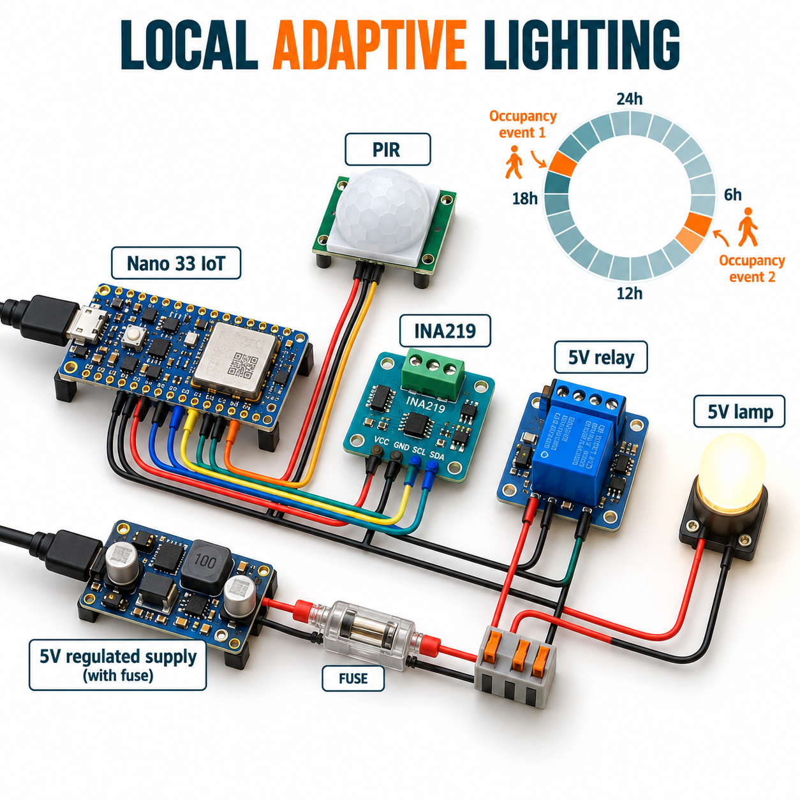

# Smart Entryway Adaptive Scheduling

A local Arduino Nano 33 IoT demonstrator learns occupancy-event counts in 24 boot-relative hour bins. Yesterday's count selects a 10- or 60-second lamp hold for the matching bin. A PIR detects motion; an INA219 monitors a small 5 V lamp; an active-high relay controls it. No Wi-Fi service, cloud or real-time clock is required.



The illustration is conceptual; follow the exact pin map and editable circuit SVG for assembly.

## Overview, objectives and features

Learn a transparent occupancy rule, safe start, bounded hold times, current fault latching and wrap-safe elapsed time. Two or more rising PIR events in yesterday's same hour select a 60-second hold; fewer select 10 seconds. Motion keeps the lamp on after warmup and explicit RESET. Invalid current or ≥500 mA turns it off and latches until a safe USB RESET. OFF and unknown commands also latch it off.

## Architecture and platform

Nano 33 IoT / Arduino samples PIR and INA219 every 100 ms, updates the shared [adaptive policy](firmware/adaptive.h), then drives relay D5. USB JSON reports once per second. [Firmware](firmware/main.cpp) uses Adafruit INA219; [host tests](tests/adaptive_test.cpp) exercise policy boundaries. The seed sketch remains as historical content and is not the PlatformIO build target. The project is local only; the board's networking hardware is unused.

## BOM quantities

| Quantity | Item |
|---|---|
| 1 | Arduino Nano 33 IoT and USB cable |
| 1 | HC-SR501 PIR with 3.3 V output |
| 1 | INA219 breakout, 0x40 address, compatible with 3.3 V I2C |
| 1 | Active-high relay module with 3.3 V-compatible IN and 5 V coil |
| 1 | 10 kΩ relay-input pulldown resistor |
| 1 | Nominal 40 mA, 5 V indicator lamp |
| 1 each | Regulated 5 V ≥1 A external supply and 1 A fuse |
| 1 | Breadboard/jumper set suitable for the low-current load |

## Prerequisites and exact pin map

Use Python 3.12, PlatformIO 6.1.18 and USB serial at 115200. PlatformIO pins atmelsam 8.3.0 and Adafruit INA219 1.2.3. Nano GPIO tolerates 3.3 V only. Verify your relay's logic threshold and active polarity before applying power.

| Pin or terminal | Connection |
|---|---|
| Nano USB | Independent USB controller supply |
| Nano D2 | PIR OUT, verified ≤3.3 V |
| Nano D5 | Relay IN; 10 kΩ to common GND |
| Nano A4 / A5 | INA219 SDA / SCL |
| Nano 3V3 | INA219 VCC |
| Fused external 5 V | PIR VCC, relay coil VCC, INA219 VIN+ |
| INA219 VIN− | Relay COM |
| Relay NO | Lamp positive |
| Relay NC | Unconnected |
| Common GND | Nano, PIR, INA219, relay, lamp and external supply negative |

## Circuit, wiring and assembly

Follow the editable [circuit diagram](docs/circuit-diagram.svg). The lamp supply passes through the INA219 shunt before the relay contact; current is measured only for the lamp, not the relay coil, PIR or Nano. INA219 VCC is 3.3 V although its monitored bus is 5 V. Do not join external 5 V positive to Nano 3V3 or USB positive.

Disconnect both supplies, check shunt direction and relay NO/COM, then verify ground and PIR output levels. Test with the lamp disconnected first. Use only a small 5 V indicator load. Keep relay contacts inaccessible to accidental shorting. Never connect mains, a door lock, a heater or other critical load.

## Setup, flashing and configuration

```sh
python -m pip install platformio==6.1.18
pio run -e nano_33_iot
pio run -e nano_33_iot -t upload
pio device monitor -b 115200
```

Select the correct USB port; double-tap reset for the Nano bootloader if upload requires it. There are no credentials or network settings. Configure PIR physical sensitivity and delay conservatively. Policy constants are a 60-second startup warmup, raw current cutoff 500 mA, 10-second ordinary hold, 60-second learned hold and two-event daily threshold. Current readings must be finite and non-negative, and sensor ACK plus a finite 0–6 V bus reading must succeed.

Startup intentionally latches off until a valid current sample and explicit `RESET\n`. Wait at least 60 seconds for PIR warmup before demonstrating output. RESET clears the latch only with valid current below 500 mA; it clears stored hold timing. Any continuing motion can request output on the next sample.

## Usage and adaptive rule

1. Start the device, inspect valid current telemetry, wait for PIR warmup, and send RESET.
2. Walk past the PIR. Motion turns the lamp on; its falling edge starts the hold measured from the last high sample.
3. On the first boot day, the hold is 10 seconds. Two separate rising motion events in an hour increment that hour's count to two.
4. After the next boot-relative day rollover, that hour uses a 60-second hold. It still requires motion; learned counts do not turn on the lamp by themselves.
5. Send `OFF\n` to latch off. A safe RESET is required to resume. Invalid or ≥500 mA readings also latch off; inspect wiring before resetting.

These are 24 one-hour bins aligned to boot and 24-hour rollovers, not wall-clock weekdays or calendar hours. The two arrays are volatile: reboot loses the learned schedule. The previous day is replaced at each rollover; if the controller jumps over more than one day between samples, old counts are cleared. Each count saturates at 65535. PIR rising edges are events, not people or true room occupancy. Learning can continue while the output is inhibited.

## Telemetry/data formats and expected output

USB emits newline-delimited JSON: `id`=20, `elapsed_s`, boot `day` and `hour`, booleans `motion`, `valid`, `relay`, `latched`, `current_ma` (number or null), `previous_count`, `today_count`, and `hold_ms`. [Sample JSONL](sample-data/adaptive.jsonl) is illustrative, not hardware-captured. Current immediately after switching can lag one sample. The OLED is not part of this project.

A first-day event at 60 seconds holds until the 70-second boundary if motion stops; exactly at the boundary output is off. A matching learned bin with two prior events extends that interval to 60 seconds. An overload sample latches off immediately within the sampling loop; this software cutoff does not replace the fuse or independent protection.

## Actual run tests and validation

```sh
g++ -std=c++17 -Wall -Wextra -Werror tests/adaptive_test.cpp -o /tmp/adaptive
/tmp/adaptive
python -m unittest discover -s tests
python tools/validate.py
python tools/validate_completion.py
pio run -e nano_33_iot
```

Host tests cover warmup, exact 10/60-second expiration, 24-hour rollover and learned counts, skipped-day clearing, current fault/reset/STOP, NaN and negative current, unsigned millis wrap and count saturation. Three transport tests and completion gates check lossless PNG SHA256/CRC/dimensions, SVG, relative links, full MIT and credential patterns. CI compiles the actual Nano 33 IoT target. [Validation results](docs/validation-results.md) will record executed cloud results before merge; final push and PR checks must pass on the exact final head. PIR, INA219 accuracy, relay switching, flashing and physical timing have not been tested.

## Troubleshooting

Latched at startup: wait for valid current then RESET. Sensor invalid: inspect A4/A5, 0x40 address, 3.3 V power, grounds and shunt direction; negative readings are rejected, not clamped. Relay never turns on: verify warmup, valid current, latch, active-high compatibility and PIR output. Excessive events: tune PIR sensitivity/delay and account for sunlight or thermal movement. Upload failure: check board selection, port and double-reset bootloader. Counts reset: they are deliberately volatile.

## Limitations and domain safety

This rule-based prototype is not machine learning, a calibrated occupancy counter or a certified safety controller. It has no RTC, persistent learning, redundant sensing, hardware emergency stop or independent current trip. Bus operations and loop timing may delay sampling. Sensor drift and electrical faults can escape the validity checks. Software cannot protect a short circuit: use the fuse, appropriate wire sizes and current-limited supply. Never apply it to mains, egress, access control, heaters, life safety or machinery.

## Future work

Measure sensor and relay timing, add a validated RTC and durable schedule with wear limits, improve occupancy evidence and separate physical protection from software scheduling.

## Contributing and license

Preserve all 24 bins, fault latching and boundary tests; update firmware, diagrams and README together. Include actual build evidence and avoid unsupported hardware claims. Full [MIT license](LICENSE).
